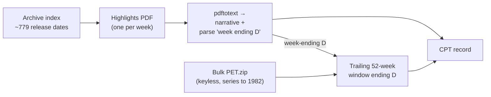

UPDATE: devset built (demo 50; full ~779) @ https://github.com/FaisalXL/Time-series-datasets/tree/main/11_eia_petroleum_weekly/output

**Repo:** https://github.com/FaisalXL/Time-series-datasets/tree/main/11_eia_petroleum_weekly

**Domain:** Energy (petroleum) · **Status:** Built (demo 50; full ~779) · **License:** Public Domain (U.S. Government work)

> One record = **one** weekly EIA report — the *Weekly Petroleum Status Report* "Highlights"
narrative paired with a trailing **52-trading-week** window of the exact national supply
series it recites (crude / gasoline / distillate stocks, refinery inputs, utilization, crude imports).
>

---

> ✅ **Alignment is strong and machine-verified (rare for us).**
The Highlights prose *recites* the series: in the 50-record demo, **all 50** text-stated crude
levels ("At X million barrels") matched the crude series' terminal value to **±0.6 Mbbl**.
The one inherent property: the report states the current week's level = the last TS point
(**terminal-value leakage**) — this is intended and the same pattern as BLS CPI / earnings calls.
>

## How we process it

**(1)** the report text is joined to a price **window** by the week-ending date parsed *from the text itself*, and **(2)** everything is fully keyless + public-domain:



- **Enumeration** — the WPSR archive index lists every release date (`YYYY_MM_DD`, ~779 back to Aug 2011); we fetch each week's Highlights PDF and extract the narrative with `pdftotext` (reading order, table rows/captions stripped).
- **Join key** — the `"week ending {Month DD, YYYY}"` string in the text is the data week-ending Friday; it anchors the 52-week series window, so the text and its window are aligned by construction.
- **Series** — national weekly channels come straight from the EIA bulk `PET.zip` (no API key), which runs back to 1982/1990, so every 2011→ report gets a full 52-week window with no short-history dropouts.

---

## Record shape

```json
{
  "text": "U.S. crude oil refinery inputs averaged 17.2 million barrels per day during the week ending June 26, 2026, which was 85 thousand barrels per day more than the previous week's average. Refineries operated at 96.6% of their operable capacity... U.S. commercial crude oil inventories (excluding the SPR)... At 408.4 million barrels... Weekly U.S. petroleum supply and inventories..., trailing 52 weeks through the week ending 2026-06-26: <ts></ts>",
  "timeseries": [
    {"values": ["...", 408359.0], "unit": "crude_stocks_exspr",     "freq": "1W"},
    {"values": ["...", 213966.0], "unit": "gasoline_stocks_total",  "freq": "1W"},
    {"values": ["...", 108599.0], "unit": "distillate_stocks",      "freq": "1W"},
    {"values": ["...",  17196.0], "unit": "refinery_crude_inputs",  "freq": "1W"},
    {"values": ["...",     96.6], "unit": "refinery_utilization",   "freq": "1W"},
    {"values": ["...",   5279.0], "unit": "crude_imports_exspr",    "freq": "1W"}
  ],
  "task_type": "world_knowledge", "text_quality": "real",
  "report_date": "2026-07-01", "data_week_ending": "2026-06-26", "window_weeks": 52,
  "dataset": "eia_petroleum_weekly", "source": "eia.gov (U.S. Government, public domain)",
  "report_url": "https://www.eia.gov/petroleum/supply/weekly/archive/2026/2026_07_01/pdf/highlights.pdf",
  "series_id": "eiapet_20260626"
}
```

---

## Design decisions (resolved)

- **Text tier = WPSR Highlights** (not "This Week in Petroleum"). TWIP is richer ~1,800-word prose but its topic varies weekly and it was discontinued ~2023 → variable/looser alignment. Highlights recite the fixed channels every week.
- **Window = 52 weeks — chosen empirically.** Across 8 sampled years, every Highlights report anchors on week-over-week change, trailing **4-week** averages, and — most frequently (9–13/report) — **year-over-year** comparisons. 52 weeks grounds all of these inside the series; the "five-year seasonal average" stays an external derived baseline.
- **6 channels** = exactly the series the narrative recites (crude/gasoline/distillate stocks + refinery inputs + utilization + crude imports); configurable.
- **Terminal-value leakage is inherent and intended** — the report states the current level = last TS point (BLS-CPI pattern). Window ends at the report's data week.
- **`text_quality:"real"`; no synthetic fallback** — a week whose text or window can't be assembled is dropped.
- **Fully keyless + public domain** — bulk `PET.zip` needs no API key; EIA data + text are U.S. Government works, so `output/` + `samples/` are committed.

---

## Open questions (for discussion)

- **Window length:** keep 52 weeks, or extend to ~260 (5 yr) to literally include the seasonal band the text compares against? (52 grounds the frequent YoY refs; 260 is a heavier TS token.)
- **Volume lift:** emit **per-product** records (crude / gasoline / distillate separately) to ~3× the count, or keep one record per weekly report?
- **Add price channels?** The Highlights also recite WTI spot + retail gasoline/diesel prices (all in bulk PET) — add them so those sentences are grounded too, or keep to the 6 supply channels?
- **Depth beyond 2011:** hunt the older EIA archive URL scheme to extend past the ~779 the current index lists?
- **Target size:** full ~779 now, or a date window?

---

## Source data (EIA, U.S. Government — public domain)

| File | Size | Use |
| --- | --- | --- |
| WPSR archive index (HTML) | ~180 KB | Enumerate ~779 release dates (`YYYY_MM_DD`, back to 2011-08-03) |
| `…/archive/{yr}/{date}/pdf/highlights.pdf` | ~170–250 KB each | Per-week Highlights narrative (text side) |
| `opendata/bulk/PET.zip` | 61 MB | National weekly supply series (keyless; parsed with stdlib) |

*(Build details, channel series IDs, and run flags:* `README.md` *in the repo. Requires `pdftotext`/poppler; build with the repo `.venv/bin/python`.)*
