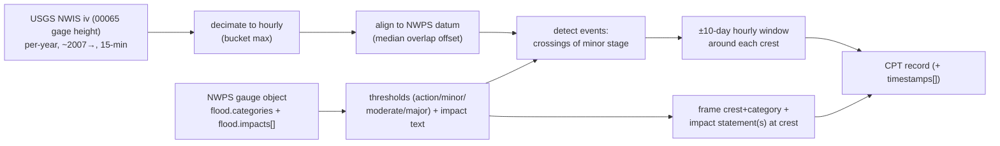

UPDATE: devset built (demo 50; full seed/national ~10k–40k events) @ https://github.com/FaisalXL/Time-series-datasets/tree/main/25_noaa_nwps_flood/output

**Repo:** https://github.com/FaisalXL/Time-series-datasets/tree/main/25_noaa_nwps_flood

**Domain:** Hydrology / river flooding · **Status:** Built (demo 50) · **License:** Public domain (NOAA/NWS + USGS) · **Defu-30 #25**

> One record = **one flood event at a river gauge** — the hourly stage hydrograph around
> the crest (Option B, event-anchored, ±10-day window) paired with the NWS flood-category
> definitions + the official impact statement(s) for the stage the river reached.

---

> ✅ **Alignment (verified).** Ohio R. at Cincinnati crested at **60.94 ft** (Apr 2025) → the
> series peaks at that value, and the paired NWS impacts ("At 60 ft: Significant flooding in
> East End, California and New Richmond…") describe exactly that level. The series reaches a
> stage; the text says what the stage *means*.
>
> ⚠️ **This is the alignment I most want your read on** — it's **"describes via threshold
> semantics"**, not value-reciting like the Fed/EIA releases. The text explains the real-world
> meaning of the stage the hydrograph reaches, rather than quoting the series value back. My
> call is that it clears the "describes" bar (much stronger than co-location), but it's a
> different, softer tier. **In-scope?**

## Harvest (measured)
- **12,756** total NWPS gauges. Sampled 60 → **~53%** carry ≥1 impact statement, **~21% (≈2,760)** have ≥5 ("rich").
- Rich gauges flood repeatedly over ~15 yr of sub-daily USGS history → **~10k–40k event records** at full national scale (Option B). Demo = verified seed of **9** rich gauges.

## How we process it

## Caveats (raised per your ask)
1. **Alignment tier** — "describes via threshold semantics" (above). The headline open question.
2. **`text_quality` hybrid** — impact statements + category defs are official NWS text (real); the one event-framing sentence (crest/date/category) is templated from the series. Tagged `"real"`; flagged for honesty.
3. **Irregular cadence** — sub-daily + gappy; we resample hourly and **omit empty buckets (no imputation)**, carrying explicit `timestamps[]`. This is the sparse-data thread's flavour B in the wild (`docs/sparse_data_problem.md`).
4. **Datum** — NWPS stage vs USGS gage height; offset computed per gauge (< 0.1 ft here), stored as `datum_offset_ft`.
5. **Coverage / enumeration** — NWPS `/gauges` list is flaky (504s) and its filters are ignored server-side; full list fetchable on retry but has no impact fields → per-gauge detail needed to filter. Demo = seed; full enumeration documented.

## Open questions (for discussion)
- **Alignment tier in-scope?** (headline — see above).
- **Window design:** ±10-day hourly (~481 pts) vs a shorter tighter window? Longer captures the full rise+recession; shorter is denser around the crest.
- **Channels:** stage only (what the text describes) vs add discharge (`00060`) as a 2nd channel?
- **Event threshold:** minor-flood crossing (current) vs action-stage (more events, thinner impacts)?
- **Enumeration:** run the full national harvest, or keep to a curated high-impact seed?

## Source data (all U.S. public domain)
| Source | Use |
| --- | --- |
| NWPS `GET /v1/gauges/{lid}` | flood categories + impact statements |
| NWPS `GET /v1/gauges/{lid}/stageflow` | recent observed stage (datum alignment) |
| USGS NWIS `iv` (`00065`) | deep hourly gage-height series |

*(Domain map / alignment bar in `../../docs/`. Build flags in `README.md`. Needs only the stdlib + PyYAML.)*
