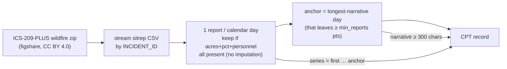

UPDATE: devset built (demo 50; full ~7–10k) @ https://github.com/FaisalXL/Time-series-datasets/tree/main/26_ics209_wildfire/output

**Repo:** https://github.com/FaisalXL/Time-series-datasets/tree/main/26_ics209_wildfire

**Domain:** Wildfire / emergency management · **Status:** Built (demo 50; full ~7–10k) · **License:** CC BY 4.0 (attribution)

> One record = **one wildfire incident** — the richest situation-report narrative for that
fire (significant events, current threat, projected activity, weather, planned actions)
paired with the incident's **daily** series: acres burned, percent contained, total personnel.
>

---

> ✅ **Alignment is genuine "describes."**
The situation report *narrates the same fire the series measures* — e.g. Donnelly Flats (AK, 1999):
*"the fire made a major run to the north… forcing the evacuation of Fort Greely… jumped the
Richardson Highway and destroyed a residential structure"* ↔ `acres` 150 → 1,500 → 3,200 → 6,000.
>
> ⚠️ **Two things to decide together tomorrow** (see Open questions): (1) **record unit** —
one-per-incident (current) vs one-per-sitrep (~10× volume); (2) **short series** — median
window ≈ 4 days because most wildfires are brief.
>

## How we process it

**(1)** the CSV is contiguous by `INCIDENT_ID`, so we stream one fire at a time; **(2)** the report with the longest narrative becomes the "anchor," and the series window ends there so text and series terminal point are the *same* report:



- **Daily points** — one report per day (last of the day); a day is kept only if all three channels are numeric, so there's **no imputation** and gaps are explicit in the `report_dates` array.
- **Anchor** — the longest combined narrative among days that still leave ≥ `min_reports` points; the window is `[first … anchor]` so the text's report is the series' endpoint (clean terminal-value alignment, BLS-style).
- **Drop** — incidents with < `min_reports` daily points or a short anchor narrative (`text_quality:"real"`, no synthetic fallback).

---

## Record shape

```json
{
  "text": "the fire made a major run to the north late sunday, forcing the evacuation of fort greely... the fire jumped the richardson highway and destroyed a residential structure...\n\nDaily situation-report values — acres burned, percent contained, and total personnel — for the Donnelly Flats Fire (AK) across 4 reporting days through 1999-06-14: <ts></ts>",
  "timeseries": [
    {"values": [150.0, 1500.0, 3200.0, 6000.0], "unit": "acres",   "freq": "1d"},
    {"values": [0.0, 0.0, 0.0, 0.0],             "unit": "percent", "freq": "1d"},
    {"values": [92.0, 119.0, 259.0, 362.0],      "unit": "persons", "freq": "1d"}
  ],
  "report_dates": ["1999-06-11", "1999-06-12", "1999-06-13", "1999-06-14"],
  "task_type": "world_knowledge", "text_quality": "real",
  "incident_id": "1999_AK-ARM-B222_DONNELLY FLATS", "incident_name": "Donnelly Flats",
  "poo_state": "AK", "start_year": "1999", "cause": "Human", "final_acres": 18000.0, "n_reports": 4,
  "dataset": "ics209_wildfire", "license": "CC BY 4.0", "series_id": "ics209_1999_AK-ARM-B222_DONNELLY FLATS"
}
```

---

## Design decisions (resolved)

- **One record per incident** (anchor narrative + arc-to-anchor). Cleanest unit to judge; the per-sitrep alternative is Open Q1.
- **3 channels** = acres / percent contained / total personnel — the metrics the narrative recites; all-present-per-day, no imputation.
- **Anchor = longest narrative**, window ends at anchor → text report == series terminal point.
- **Irregular cadence, handled honestly** — `freq:"1d"` + explicit `report_dates` (weekend/gap days simply absent), à la FNSPID.
- **`text_quality:"real"`** — authentic incident-command prose (lowercase, typos kept); short/empty-narrative incidents dropped.
- **Open license** — CC BY 4.0, so `output/` + `samples/` are committed (attribution: St. Denis et al. 2023).

---

## Open questions (for discussion)

- **Q1 — record unit:** one-per-incident (current, ~7–10k) or one-per-sitrep (~80k, each report's narrative + arc-to-date)? The latter is ~10× data but nests overlapping series.
- **Q2 — short series:** median window ≈ 4 days (most fires are brief). Raise `min_reports` (e.g. 5–7) to bias toward large, dynamic fires, or keep coverage?
- **Channels:** add `EST_IM_COST_TO_DATE` and structures-threatened/destroyed? (more blanks early → shrinks the all-present daily grid.)
- **Complexes:** special-case sub-fire merges via `complex_associations` (fixes non-monotonic early `ACRES`), or leave as-is?
- **All-hazards extension:** the same schema covers hurricane/flood/hazmat (`ics209plus-allhazards`) — a future multi-domain expansion?

---

## Source data (ICS-209-PLUS, St. Denis et al. 2023 — CC BY 4.0)

| File | Size | Use |
| --- | --- | --- |
| `ics209plus-wildfire.zip` (figshare file 38766504) | 48.7 MB | Bundle we download (keyless) |
| └ `ics209-plus-wf_sitreps_1999to2020.csv` | 300 MB | **Main** — one row per sitrep (153 cols: narratives + metrics + dates) |
| └ `ics209-plus-wf_incidents_1999to2020.csv` | 27 MB | Incident summary (final acres, totals) — reference |
| └ `ics209-plus-wf_complex_associations_...csv` | 7.9 MB | Complex/sub-fire merges — for Open-Q "complexes" |
| `ics209plus-reference/*field-definitions*` | — | Data dictionary for all 153 columns |

*(Build flags + full field list:* `README.md` *in the repo. Stdlib only; build with the repo `.venv/bin/python`.)*
