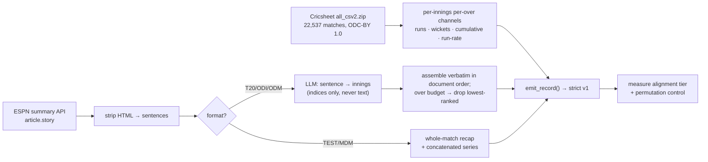

UPDATE: rebuilt on the full Cricsheet universe, schema-v1 clean, ceiling re-measured @ https://github.com/FaisalXL/Time-series-datasets/tree/main/45_cricket_report_overseries/output

**Repo:** https://github.com/FaisalXL/Time-series-datasets/tree/main/45_cricket_report_overseries

**Domain:** Sports / cricket · **Status:** Built, **quarantined on licence** · **License:** ESPNcricinfo editorial — `proprietary-review` · **Defu-30 #45**

> One record = **one innings** (limited-overs) or **one match** (Tests/multi-day) — the
> per-over run/wicket/cumulative/run-rate series paired with the passage of the real
> ESPNcricinfo match report that narrates it. Cricsheet's match filename **is** the ESPN
> match id, so the join is exact, not fuzzy.

---

## 🔴 The ask: this is a licence decision, and it is the only thing blocking the package

Everything technical is now done and measured. The package builds, passes
`validate.py --strict` at 100%, and has a permutation control behind its alignment claim.
It cannot ship regardless, because the prose is copyrighted ESPNcricinfo editorial and
`SCHEMA.md` §6 defines `proprietary-review` as *"excluded from any release until cleared."*
This has been flagged since July and never actually put to you. Three options:

1. **Clear it for training-only use, no redistribution.** The corpus is used to train, the
   text is never republished. Needs a view on whether ESPN's ToS permits that.
2. **Approach ESPN for a research licence.** Worth noting the rightsholder here is a
   *single in-house publisher* — `article.source` is empty on all 467 covered reports we
   sampled, i.e. this is ESPNcricinfo staff journalism. It is **not** AP wire copy. That
   makes #45 a materially easier ask than **#51 `espn_us_majors`**, whose recaps *are* AP
   and which should not be bundled into the same request.
3. **Drop #45.** Defensible — at ~27k it is not a volume play. But it is a `describes`-tier
   package with an exact join, and `describes` is the tier the corpus is short of.

**Recommendation: 1 or 2.** Do not bundle with #51.

---

## 📏 The ceiling was wrong in both directions — here is the measured number

| Source | Claim | Verdict |
|---|--:|---|
| `docs/scouting_build_queue.md`, `docs/next_candidates.md` | ~44,000 | too high — assumed near-full report coverage |
| `cpt_corpus/REVIEW_STATUS.md` ceiling audit, 2026-08-11 | ~1,900 | **too low by ~14×** — bounded the package to IPL by assumption |
| **Measured, 2026-08-11** | **~27,300** | full-archive parse + 844-match stratified ESPN sample |

The audit was right that all-format coverage is "well below 74%" — it is **55.3%** — but
55.3% of a 22,537-match universe is ~27k innings, not 1.9k. The IPL-only bound was never
measured; this is the same *"is the filter that bounds this package's scale measured, or
assumed?"* question that REVIEW_STATUS asks of `52`/`53`.

**Universe (counted, not sampled):** 22,537 matches → 49,893 innings → **47,906 innings ≥12
overs**. **Coverage (844-match stratified sample, ratio estimator):** 55.3% of matches carry
a ≥400-char report → **27,334 innings, 95% CI 25,854–28,814**.

Coverage is badly era-skewed, which matters for any capped run: TEST 2020+ ~100%, MDM
2015-19 ~97%, but T20 male 2020+ 39%, T20 female 2020+ 39%, ODI pre-2005 **0%**. A
`max_records` cap walks match ids in ascending order = **oldest first**, so a capped build
is not a random sample of the package. Flagged in `config.example.yaml`.

## 🧩 Record shape is hybrid, and the split is measured

A cricket report is one document per match, but a limited-overs match has two innings — so
the old build emitted the *same prose twice* (4× for Tests). We now split by format:

| | shape | why |
|---|---|---|
| T20 / IT20 / ODI / ODM | **per innings** | an LLM assigns each sentence to the innings it narrates; the builder assembles **verbatim from indices**, so `text_quality` stays `real` |
| TEST / MDM | **per match** | attribution is *inverted* here — see below |

Measured on 60 matches, does an innings' attributed passage recite **its own** innings score
versus **another innings of the same match**:

| | T20 | ODI | ODM | MDM | TEST |
|---|---|---|---|---|---|
| own innings | 23% | 29% | 25% | 20% | **7%** |
| wrong innings | 10% | 0% | 0% | 20% | **20%** |

On Tests the model recites the wrong innings three times as often as the right one, and MDM
is at chance. That is not the reports' fault — they are whole-match recaps (`type: "Recap"`,
posted d+2/d+3, i.e. at match end), so four interleaved innings simply cannot be separated
sentence-by-sentence. Those formats are built per-match, where the report's own unit and the
record's unit agree. Contract and rationale: `prompts/attribute_v1.md`.

**The model never sees the series.** It sees only the innings roster (who batted when),
which is Cricsheet metadata. Showing it the runs and asking which sentences match would
score better on every alignment metric we have and would destroy the control below.

## ✅ BUILT — 20,678 records, 20,678/20,678 strict

Full build over all 22,537 matches, 2026-08-11. **85 MB · 5,203,680 datapoints · 99.99%
distinct texts** (2 collisions in 20,678). Previous builder returned 0/50 under `--strict`.

| | records |
|---|--:|
| per-innings (T20 13,158 · ODI 2,760 · ODM 2,444 · IT20 72) | 18,434 |
| per-match (MDM 1,756 · TEST 488) | 2,244 |
| **total** | **20,678** |
| `recites` / `describes` | **18,117 / 2,561** (87.6% recites) |

10,477 matches were dropped for having no usable report — that is the 55.3% coverage
measured beforehand, reproduced by the census at **53.1%** (10,207 ok / 19,237 fetched).

### Alignment, with a permutation control

`recites` / `describes` is **measured per record**, not asserted — the treatment `08_bls_cpi`
got. A record is `recites` only if the prose states every innings total its series carries, as
an ordered (runs, wickets) pair, and the tier is measured **after** any truncation so a tag can
never be orphaned. Control = the same prose against a **different match's** totals:

| | T20 | ODI | ODM | MDM | TEST | IT20 |
|---|---|---|---|---|---|---|
| n | 13,158 | 2,760 | 2,444 | 1,756 | 488 | 72 |
| true | 89.0% | 86.8% | 92.7% | 77.0% | 69.5% | 80.6% |
| permuted control | 0.6% | 0.6% | 0.5% | 0.0% | 0.0% | 2.8% |
| **lift** | **+88.4pp** | **+86.2pp** | **+92.2pp** | **+77.0pp** | **+69.5pp** | **+77.8pp** |

**The control partner must be a different match, and getting that wrong is easy.** Records are
emitted in match order, so a per-innings record's neighbour is *the other innings of its own
match* — whose total the shared lede legitimately recites. Pairing against it measured the lede
rather than coincidence and reported a 41% control; forcing a different match puts it at 0.6%.

Two notation traps were also found and handled: ESPN uses **both** score conventions — English
"194 for 4" (runs first) and Australian "6 for 194" (wickets first, **11%** of team scores) —
and bowling figures ("Lyon 3-48") look like scores but are excluded, since including them
injected 8 false positives per 874 matches.

## ⚠️ Open decision this package is exposed to: the window floor

A T20 innings is **exactly 20 per-over steps**, below the 32-step floor used elsewhere, and
T20 is 56% of the package. Per-innings records for T20/IT20 are shippable **only if the floor
relaxes to ≤16** — the same decision that gates `58_fas_gain_attache`. `run_report.json`
reports the surviving count at every candidate floor (12/16/20/24/32) so the exposure is
visible rather than buried. If the floor stays at 32, switch
`shape.two_innings_mode: per_match` and the package rebuilds at ~12k records, all formats
clearing 32.

## How we process it

## Caveats (raised per your ask)

1. **Licence — the blocker.** Above. Nothing else gates this package.
2. **The shared lede is attached to both innings records of a match.** The opening sentence
   ("Titans 194 for 4 … beat Lions 152 for 8 by 42 runs") is match-level and recites both
   totals; dropping it would strip the package of its `recites` evidence and leave passages
   that never say who was playing. **Measured cost: sentence overlap between a match's two
   records is median 0%, mean 5.8%**, and 99.99% of texts are distinct — against 2.24×
   duplication in the old shape. (An earlier draft of this page estimated "~2 sentences of
   overlap"; the measured figure is lower and replaces it.)
3. **T20 series length vs the window floor — no longer an open exposure.** As built (per-over)
   the package swings 3× on the floor decision: **12 → 20,678 · 16 → 19,987 · 20 → 17,231 ·
   24 → 7,239 · 32 → 6,885.** Measured 2026-08-12, switching limited-overs innings to
   **per-delivery** series puts **20,675 of 20,678** records above floor 32 (median 125 steps,
   max 446, 2.9× the datapoints). It needs no schema change — `1play` is already in the
   validator's `FREQ_RE` — and does not touch the text, so the licence position and the
   alignment evidence are unchanged. **This is ours to fix and is not part of your decision.**
4. **Two builder bugs fixed in this pass**, both of which corrupted the number the alignment
   claim rests on: `retired hurt` / `retired not out` were counted as wickets (they are not
   dismissals — this is the "152 for 8" vs a computed 9 gap), and `report_published` stored
   `article.published`, a CMS re-stamp that disagrees with the real posting date by >30 days
   in **72%** of articles. It now stores `originallyPosted`.
5. **Host move.** `site.api.espn.com` began returning 403 (Akamai) for every user agent in
   August — a host move, not a bot wall. `site.web.api.espn.com` serves the identical payload
   and accepts our identifying research UA; no spoofing is involved. **The other four ESPN
   sports packages were scouted through the dead host and need the same one-line fix.**
6. **Never use the `news[]` array as a text fallback.** It is carrier-league contaminated
   with generic articles for unrelated matches. Only `article` is match-specific.
7. **The series half is clean.** Cricsheet is ODC-BY 1.0 and would remain usable even if the
   text is refused.
