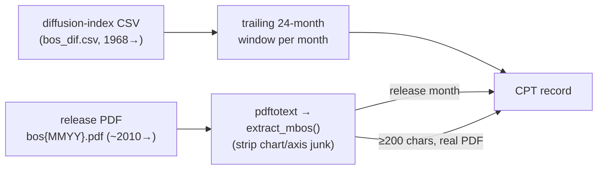

UPDATE: devset built (demo 50, Philadelphia MBOS; full MBOS ~190) @ https://github.com/FaisalXL/Time-series-datasets/tree/main/47_fed_regional_surveys/output

**Repo:** https://github.com/FaisalXL/Time-series-datasets/tree/main/47_fed_regional_surveys

**Domain:** Macro / regional business conditions · **Status:** Built (demo 50, v1 = Philadelphia MBOS) · **License:** Public domain (U.S. Federal Reserve)

> One record = **one (survey, month)** — a Reserve Bank's monthly survey release narrative
(which recites the diffusion-index readings) + a trailing **24-month** window of those indices.
Self-contained, value-reciting "describes." **Federated**: v1 ships Philadelphia MBOS; the
other ~18 Tier-1 Fed surveys slot in as config entries (see `fed_surveys_discovery.md`).
>

---

> ✅ **Strongest-tier alignment, verified.**
June 2026 MBOS: *"the diffusion index for current general activity rose from -0.4 in May to
**10.3** in June"* ↔ the `general_activity` series terminal = **10.3**. The prose states the
exact number the series holds — EIA/BLS-tier, and with **no external join** (unlike Beige Book).
>
> ⚠️ **Two flags** (see below): (1) **FRED overlap** — the series are on FRED (Oliver's #9); the
novel bit is the narrative pairing. (2) **Real-time vs revised** — the CSV is latest-SA data;
narratives are as-of-release, so deep-history points drift slightly (ALFRED-style).
>

## How we process it

Self-contained per survey: the diffusion CSV is the series; the monthly release **PDF** is the text; the release month joins them.



- **Series** — `bos_dif.csv` parsed with stdlib; 7 channels (general activity, new orders, shipments, employment, prices paid/received, future general activity), trailing 24 months.
- **Text** — release PDF → `pdftotext`; `extract_mbos()` keeps the executive summary + detailed sections, **breaks at chart-axis contamination** (year sequences leaked into prose) and the methodology footer, repairs justified hyphenation. Layout-robust across 2010–2026.
- **Drop** — months with no real PDF (older = HTML shell) or too-short narrative. `text_quality:"real"`, no synthetic fallback.

---

## Record shape

```json
{
  "text": "Manufacturing activity in the region expanded overall... general activity and new orders rebounded into positive territory... current general activity rose from -0.4 in May to 10.3 in June...\n\n... trailing 24 months through June 2026: <ts></ts>",
  "timeseries": [
    {"values": ["...", 10.3], "unit": "general_activity", "freq": "1M"},
    {"values": ["...", 27.3], "unit": "new_orders", "freq": "1M"},
    {"values": ["...", 14.9], "unit": "shipments", "freq": "1M"},
    {"values": ["...", "..."], "unit": "employment", "freq": "1M"},
    {"values": ["...", "..."], "unit": "prices_paid", "freq": "1M"},
    {"values": ["...", "..."], "unit": "prices_received", "freq": "1M"},
    {"values": ["...", "..."], "unit": "future_general_activity", "freq": "1M"}
  ],
  "task_type": "world_knowledge", "text_quality": "real",
  "survey": "philadelphia_mbos", "bank": "Federal Reserve Bank of Philadelphia", "district": 3,
  "domain": "manufacturing", "release_month": "2026-06", "window_months": 24,
  "dataset": "fed_regional_surveys", "license": "Public domain (U.S. Federal Reserve)",
  "series_id": "fedsurvey_philadelphia_mbos_2026-06"
}
```

---

## Design decisions (resolved)

- **One record per (survey, month)**, trailing 24-month window — matches EIA/earnings pattern; window is always full (series to 1968).
- **7 channels** = the indices the narrative recites (current panel + future general activity); diffusion indices (dimensionless), identity in `unit` per repo convention.
- **Text = PDF via pdftotext**, executive summary + detail, chart-junk stripped, hyphenation repaired; layout-robust.
- **Federated config** (`data.surveys` registry) so NY/Richmond/Dallas/KC add as entries (each needs its own `extract_*`).
- **Public domain** → `output/` + `samples/` committed.

## Open questions (for discussion)

- **FRED overlap sign-off** (Charon): the series are on FRED (#9). OK to build on the narrative-pairing novelty?
- **Window length:** 24 months, or longer to ground "multiyear high" / "long-run average" references the narrative makes?
- **Current vs future indices:** keep `future_general_activity` (an expectation, not a current reading) in the panel, or split current/future?
- **Federation order:** manufacturing family first (Philly✓, NY, Richmond, Dallas TMOS, KC, StL), then services/energy/ag/banking?
- **Real-time vs revised:** accept latest-SA series (current-month essentially unrevised), or source vintage data?

## Source data (Philadelphia Fed MBOS — U.S. public domain)

| File | Use |
| --- | --- |
| `…/Diffusion-Indexes/bos_dif.csv` | Series — 21 diffusion indices, May 1968→present (✅ 200) |
| `…/mbos/{YYYY}/bos{MMYY}.pdf` | Monthly release narrative (✅ 200; real PDFs ~2010→) |
| `…/mbos-definitions` | Column code definitions |

*(Full survey-family map — ~18 Tier-1 surveys across 7 banks — in `fed_surveys_discovery.md`. Build flags in `README.md`. Needs `pdftotext`; build with repo `.venv/bin/python`.)*
