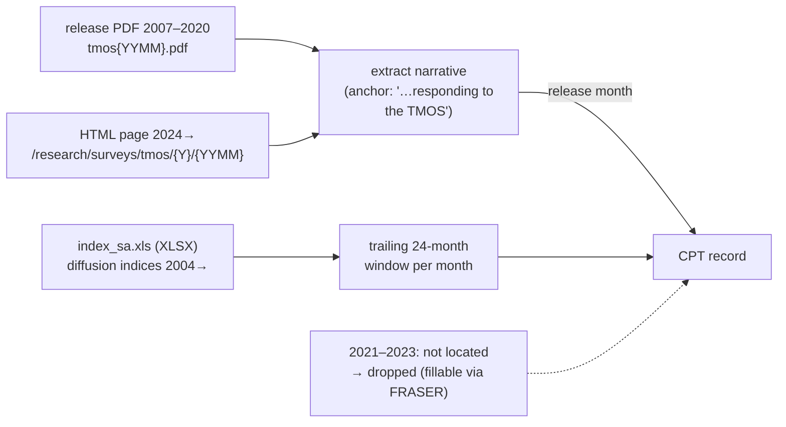

UPDATE: devset built (demo 50; full ~195) @ https://github.com/FaisalXL/Time-series-datasets/tree/main/48_dallas_tmos/output

**Repo:** https://github.com/FaisalXL/Time-series-datasets/tree/main/48_dallas_tmos

**Domain:** Macro / regional manufacturing conditions · **Status:** Built (demo 50) · **License:** Public domain (U.S. Federal Reserve)

> One record = **one release month** — the Dallas Fed Texas Manufacturing Outlook Survey
(TMOS) release narrative (which recites the diffusion-index readings) + a trailing **24-month**
window of those indices. Self-contained, value-reciting "describes." Sibling of MBOS
(`47_philadelphia_mbos`); Dallas also runs TSSOS/Energy/Ag/Banking — see `docs/fed_surveys_discovery.md`.
>

---

> ✅ **Strong alignment.** June 2025 (verified earlier): *"general business activity index
inched up to **-12.7**"* ↔ data column `Bact` = **-12.7** (exact). Richest series of the surveys
so far (34 sub-indices), cleanest narrative when present.
>
> ⚠️ **Two real caveats found during the build:** (1) a **2021–2023 text gap** (Dallas PDF archive
ends 2020, HTML pages start 2024; the intermediate releases weren't locatable on dallasfed.org).
(2) **vintage drift** — the SA series is re-benchmarked annually, so older months drift ~0.5–2 pts
from the narrated (as-published) value. Both documented below.
>

## How we process it



- **Series** — `index_sa.xls` is actually XLSX; parsed with the **stdlib** (zipfile + xml.etree), no openpyxl. 7 channels (general business activity, production, new orders, shipments, employment, raw-materials prices, company outlook), trailing 24 months.
- **Text** — tries the PDF (2007–2020) then the HTML page (2024→). One extractor works on both (anchor on the invariant survey citation; stop at the boilerplate footer). Layouts/lead-wording vary by era; the anchor is robust.
- **Drop** — months with no retrievable release (incl. the 2021–2023 gap). `text_quality:"real"`, no synthetic fallback.

---

## Record shape

```json
{
  "text": "Texas manufacturing output growth decelerated in June, according to business executives responding to the Texas Manufacturing Outlook Survey. The production index... fell five points to 4.1...\n\n... trailing 24 months through June 2026: <ts></ts>",
  "timeseries": [
    {"values": ["...", 0.0], "unit": "general_business_activity", "freq": "1M"},
    {"values": ["...", 4.1], "unit": "production", "freq": "1M"},
    {"values": ["...", 2.3], "unit": "new_orders", "freq": "1M"},
    {"values": ["...", 7.1], "unit": "shipments", "freq": "1M"},
    {"values": ["...", "..."], "unit": "employment", "freq": "1M"},
    {"values": ["...", "..."], "unit": "prices_raw_materials", "freq": "1M"},
    {"values": ["...", "..."], "unit": "company_outlook", "freq": "1M"}
  ],
  "task_type": "world_knowledge", "text_quality": "real",
  "bank": "Federal Reserve Bank of Dallas", "survey": "Texas Manufacturing Outlook Survey",
  "district": 11, "domain": "manufacturing", "release_month": "2026-06", "window_months": 24,
  "dataset": "dallas_tmos", "license": "Public domain (U.S. Federal Reserve)", "series_id": "tmos_2026-06"
}
```

---

## Design decisions (resolved)

- **One record per release month**, trailing 24-month window (series to 2004 → always full).
- **7 channels** the narrative recites; diffusion indices (dimensionless), identity in `unit`.
- **Dual text source** (PDF 2007–2020 + HTML 2024→) with one anchor-based extractor.
- **XLSX parsed with stdlib** (no new dependency).
- **One dataset per survey** (not federated); public domain → output committed.

## Open questions (for discussion)

- **2021–2023 gap:** worth filling via FRASER / Wayback (adds ~36 months), or ship with the hole?
- **Vintage drift (family-wide):** accept ~0.5–2 pt drift on older months, or source original-vintage / extract the as-published value from each release? Affects MBOS/Empire/TMOS alike.
- **FRED overlap** sign-off (Charon).
- **Window length** 24 vs longer; **current vs future** indices.
- **Next sibling:** Dallas TSSOS (services) reuses this exact plumbing; or Richmond (clean XLSX + PDF).

## Source data (Dallas Fed TMOS — U.S. public domain)

| File | Use |
| --- | --- |
| `…/tmos/documents/index_sa.xls` | Series — 34 SA diffusion indices, Jun-2004→ (✅ 200; XLSX) |
| `…/tmos/{YYYY}/tmos{YYMM}.pdf` | Release narrative 2007–2020 (✅ 200 PDF) |
| `…/research/surveys/tmos/{YYYY}/{YYMM}` | Release narrative 2024→ (✅ 200 HTML) |
| 2021–2023 | ⚠ not located on dallasfed.org — FRASER/Wayback |

*(Family map in `docs/fed_surveys_discovery.md`. Build flags in `README.md`. Needs `pdftotext`; build with repo `.venv/bin/python`.)*
