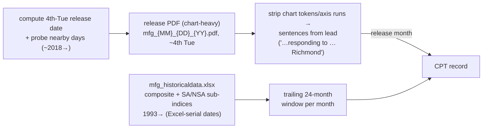

UPDATE: devset built (demo 50; full ~100) @ https://github.com/FaisalXL/Time-series-datasets/tree/main/49_richmond_manufacturing/output

**Repo:** https://github.com/FaisalXL/Time-series-datasets/tree/main/49_richmond_manufacturing

**Domain:** Macro / regional manufacturing conditions · **Status:** Built (demo 50) · **License:** Public domain (U.S. Federal Reserve)

> One record = **one release month** — the Richmond Fed *Fifth District Survey of Manufacturing
Activity* release narrative (which recites the diffusion indices) + a trailing **24-month**
window of those indices. Value-reciting "describes." Fifth District = MD/VA/NC/SC/WV/DC.
Sibling of MBOS (`47`) and Dallas TMOS (`48`); Richmond Non-Manufacturing is a separate package.
>

---

> ✅ **Alignment verified.** June 2026: *"The composite manufacturing index decreased to **4**
in June from 13 in May"* ↔ `composite_index` = **4** (May 13) — exact.
>
> ⚠️ **Three caveats found during the build:** (1) release-PDF text only **~2018→** (older
releases off the live site → ~100 records despite series to 1993); (2) **chart-heavy PDFs** →
extraction is best-effort (strips chart-axis junk; occasional value drops); (3) **vintage
drift** (SA re-benchmark): 2025+ exact, pre-2024 median ~2pt (max ~5).
>

## How we process it



- **Series** — `.xlsx` parsed with the stdlib (zipfile+xml); dates are Excel serials. 7 SA current channels (composite + shipments/new orders/employment/backlog/capacity util/wages).
- **Text** — no clean archive, so the build **computes** the release date (~4th Tuesday) and probes nearby days for the PDF; chart-heavy layout → strip axis labels + number-runs, keep prose sentences from the lead. Best-effort.
- **Drop** — months with no retrievable release (pre-~2018). `text_quality:"real"`, no synthetic fallback.

---

## Record shape

```json
{
  "text": "Fifth District manufacturing activity was flat in June, according to the most recent survey from the Federal Reserve Bank of Richmond. The composite manufacturing index decreased to 4 in June from 13 in May... Shipments fell to 3 from 16, new orders to 9 from 17, and employment to -1 from 3.\n\n... trailing 24 months through June 2026: <ts></ts>",
  "timeseries": [
    {"values": ["...", 4.0], "unit": "composite_index", "freq": "1M"},
    {"values": ["...", 3.0], "unit": "shipments", "freq": "1M"},
    {"values": ["...", 9.0], "unit": "new_orders", "freq": "1M"},
    {"values": ["...", -1.0], "unit": "employment", "freq": "1M"},
    {"values": ["...", "..."], "unit": "order_backlog", "freq": "1M"},
    {"values": ["...", "..."], "unit": "capacity_utilization", "freq": "1M"},
    {"values": ["...", "..."], "unit": "wages", "freq": "1M"}
  ],
  "task_type": "world_knowledge", "text_quality": "real",
  "bank": "Federal Reserve Bank of Richmond", "survey": "Fifth District Survey of Manufacturing Activity",
  "district": 5, "domain": "manufacturing", "release_month": "2026-06", "window_months": 24,
  "dataset": "richmond_manufacturing", "license": "Public domain (U.S. Federal Reserve)", "series_id": "rich_mfg_2026-06"
}
```

---

## Design decisions (resolved)
- **One record per release month**, trailing 24-month window (series to 1993 → always full).
- **7 SA current channels** (composite headline + 6 components/sub-indices); diffusion indices, identity in `unit`.
- **Computed release-date enumeration** (no archive listing); text `min_text_year=2017` to skip pre-PDF months.
- **XLSX parsed with stdlib**; Excel-serial dates.
- **One dataset per survey**; public domain → output committed.

## Open questions (for discussion)
- **Vintage drift (family-wide):** accept ~1–2pt drift on older months, or switch to the **NSA** columns Richmond also ships (less re-benchmark), or source original-vintage? Same call for MBOS/TMOS.
- **Fill pre-2018 text?** FRASER/Wayback could extend below 2018 (adds records; more work).
- **FRED overlap** sign-off (Charon).
- **Extraction quality:** the chart-heavy PDF extractor is best-effort — invest more if the occasional dropped value matters.
- **Next sibling:** Richmond Non-Manufacturing (reuses this plumbing) or Kansas City.

## Source data (Richmond Fed — U.S. public domain)
| File | Use |
| --- | --- |
| `…/manufacturing/data/mfg_historicaldata.xlsx` | Series — composite + SA/NSA sub-indices, 1993→ (✅ 200; XLSX) |
| `…/manufacturing/{YYYY}/pdf/mfg_{MM}_{DD}_{YY}.pdf` | Release narrative (✅ 200 PDF; ~2018→) |
| archive page | lists only recent releases (JS-paginated) → build computes dates instead |

*(Family map in `../../docs/fed_surveys_discovery.md`. Build flags in `README.md`. Needs `pdftotext`; build with repo `.venv/bin/python`.)*
